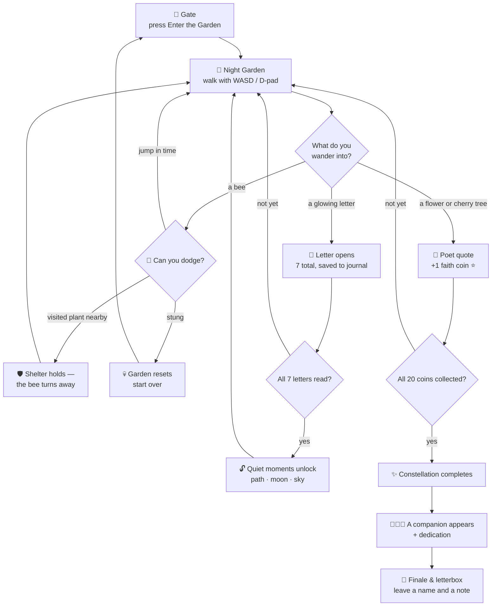
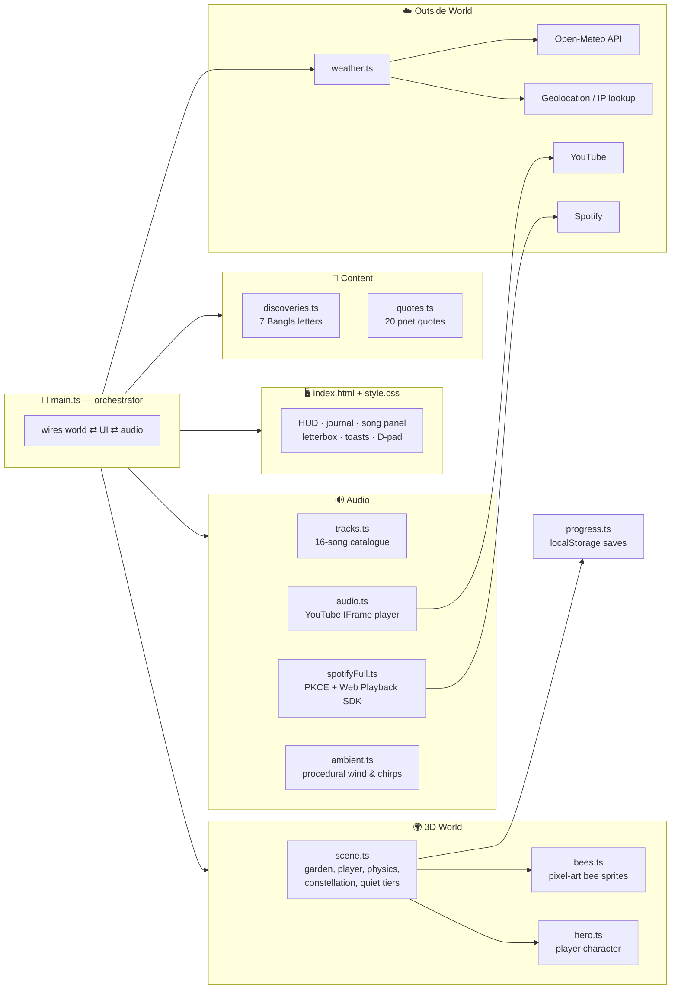
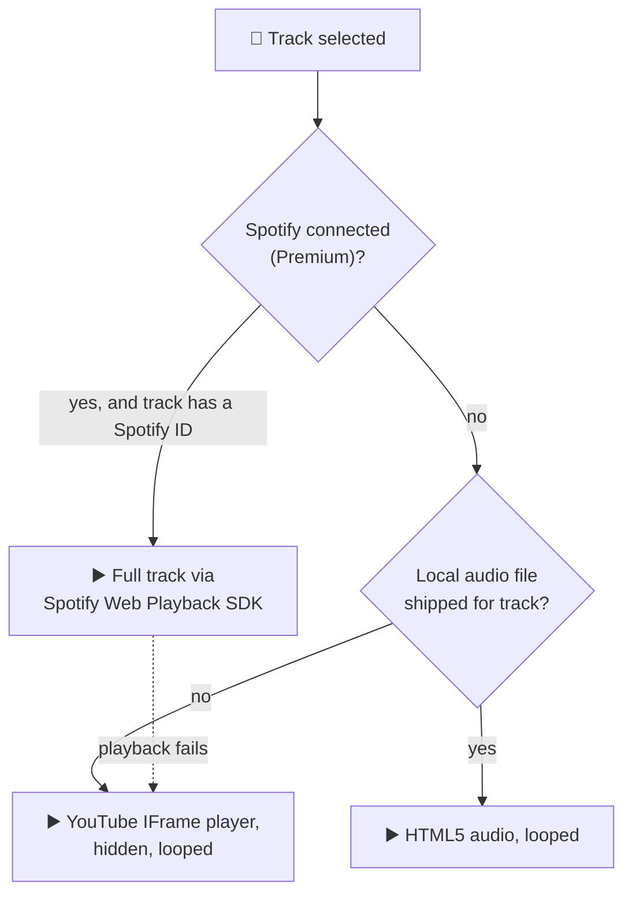

<div align="center">

# 🌸 প্রেয়সীপাড় — If You Knew Me

**A slow, quiet 3D garden of letters — built to be wandered, not scrolled.**

[](https://bonrakinab.github.io/if-you-knew-me/)
[](https://threejs.org/)
[](https://www.typescriptlang.org/)
[](https://vitejs.dev/)

*এটি প্রেম নিবেদনের জায়গা নয়। অনুভূতি, চিন্তা, দর্শন, চিঠি আর পারস্পরিক বোঝাপড়ার একটি নীরব আশ্রয়।*

*"This is not a place for declarations. It is a quiet shelter of feelings, thoughts, letters, and slow understanding."*

</div>

---

## ✨ What is this?

**প্রেয়সীপাড় (Preyoshipar)** is a small hand-crafted world rendered in the browser, and **বহ্নি (Banhi)** is the girl it was made for — the one who walks its paths. You wander through a night garden, and things notice you back: hidden **letters** written in Bangla light up as you approach, **flowers and cherry trees** whisper poetry from Tagore, Nazrul, Jibanananda, Rumi, Shakespeare, Hafiz, and Gibran, **bees** wander and sting the careless, and the sky above mirrors the **real weather outside your window**.

Find everything, and the stars themselves rearrange.

<table>
<tr>
<td width="33%" valign="top">

### 💌 Seven Letters
Seven Bangla letters are scattered through the garden. Walk close and they open — each one a step in a slow journey of getting to know someone, patiently.

</td>
<td width="33%" valign="top">

### 🌼 Twenty Poems
Flowers and sakura trees hold quotes from the great poets. Touch each one to collect a **faith coin** — and light one more star in the sky.

</td>
<td width="33%" valign="top">

### 🐝 Wandering Bees
The garden is not entirely safe. Bees roam and sting on contact — **jump** to dodge them, or shelter beside a plant you've already visited and it will turn them away.

</td>
</tr>
<tr>
<td width="33%" valign="top">

### 🎶 A Living Soundtrack
Twenty-seven songs — **Tajwar** (*Shesh Bikele* plays by default), **Habib Wahid**, **Arnob**, plus Nepali songs by **Sajjan Raj Vaidya** and **Yabesh Thapa** — stream via YouTube, with optional full-track playback through **Spotify Premium**. Procedural wind and birdsong underneath.

</td>
<td width="33%" valign="top">

### 🌦️ Real Weather, Real Time
The garden asks (politely) where you are, then matches its rain, fog, snow, or clear skies to your actual weather via Open-Meteo. Your local time ticks in the corner.

</td>
<td width="33%" valign="top">

### ⭐ The Constellation
Collect all twenty faith coins and a constellation completes overhead. A companion appears in the garden, a dedication fades in, and a letterbox opens for a reply.

</td>
</tr>
<tr>
<td width="33%" valign="top">

### 🗺️ Five Worlds
The story now spans five chapters: the **night garden**, a **desert of pyramids**, a **monsoon river village**, an **autumn Dhaka rooftop** with kites and a tea stall, and a **snowy mountain shrine** with prayer flags.

</td>
<td width="33%" valign="top">

### 🌱 Seeds & Time Capsules
Every faith coin drops a **seed** — plant it anywhere and it grows into a sheltering plant that survives resets. **Bury a message** in the ground and it reopens on a future visit, exactly where you left it.

</td>
<td width="33%" valign="top">

### 📸 Postcards & Fireflies
A **photo mode** turns any moment into a postcard stamped with a poet's line and the date. **Guide fireflies** stream quietly from you toward the nearest unread letter.

</td>
</tr>
</table>

---

## 🗺️ The Journey

How a visit unfolds, from the front gate to the final letterbox:



---

## 🏗️ Architecture

Everything is a small, focused TypeScript module. No framework — just Three.js, the DOM, and a handful of browser APIs.



### How the music decides what to play



---

## 🎮 Controls

| Action | Keyboard | Phone |
|---|---|---|
| Walk | `W` `A` `S` `D` / arrow keys | on-screen D-pad |
| Run | hold `Shift` | **Run** button |
| Jump (dodge bees) | `Space` | **Jump** button |
| Dance | `X` | **Dance** button |
| Read / collect | just walk close | just walk close |
| Journal | 📖 button | 📖 button |
| Mute / track picker | HUD buttons | HUD buttons |

---

## 🚀 Getting Started

```bash
# clone and install
git clone https://github.com/bonrakinab/if-you-knew-me.git
cd if-you-knew-me
npm install

# develop with hot reload
npm run dev

# type-check + production build (outputs to dist/)
npm run build

# preview the production build locally
npm run preview
```

### Deploying

The site is a fully static build served from **GitHub Pages** (the `gh-pages` branch). `vite.config.ts` sets `base: "/if-you-knew-me/"` so assets resolve under the project path.

```bash
npm run build
npx gh-pages -d dist --nojekyll
```

Live at → **https://bonrakinab.github.io/if-you-knew-me/**

### Optional: full-track Spotify playback

By default, songs play through a hidden YouTube player — no setup needed. For gapless full tracks:

1. Create an app in the [Spotify Developer Dashboard](https://developer.spotify.com/dashboard) and copy its **Client ID**.
2. Add the deployed URL (and/or `http://localhost:5173/if-you-knew-me/`) as a **Redirect URI**.
3. Either set `VITE_SPOTIFY_CLIENT_ID` in a `.env` file, or paste the ID into the song panel in-app and press **Connect**.
4. Log in with a **Spotify Premium** account. The garden becomes a Spotify Connect device named *"প্রেয়সীপাড় Garden"*.

---

## 🗂️ Project Structure

```
if-you-knew-me/
├── index.html          # all UI markup: gate, HUD, journal, song panel, letterbox
├── vite.config.ts      # base path for GitHub Pages
├── public/             # favicon, icon sprites
└── src/
    ├── main.ts         # orchestrator — wires world, UI, audio, weather
    ├── scene.ts        # the Three.js garden: terrain, player, bees, stars
    ├── hero.ts         # player character model & poses
    ├── bees.ts         # pixel-art bee sprites (canvas-drawn, no assets)
    ├── discoveries.ts  # the seven Bangla letters
    ├── quotes.ts       # twenty poet quotes (flowers & sakura)
    ├── tracks.ts       # song catalogue: Tajwar & Habib Wahid
    ├── audio.ts        # YouTube IFrame background music
    ├── spotifyFull.ts  # Spotify PKCE auth + Web Playback SDK
    ├── ambient.ts      # procedural wind & birdsong (Web Audio)
    ├── weather.ts      # geolocation + Open-Meteo live weather
    ├── progress.ts     # localStorage garden saves
    └── style.css       # the whole look
```

---

## 💾 What gets remembered

Everything is stored locally in the browser — there is no server and no account.

| Key | Holds |
|---|---|
| `if-you-knew-me-garden` | letters read, quotes found, quiet moments unlocked |
| `if-you-knew-me-track-v2` | last chosen song |
| `if-you-knew-me-note` | the name and reply left in the letterbox |
| `if-you-knew-me-spotify-*` | optional Spotify client ID and tokens |

A bee sting clears the garden save and starts the journey over. The **reset** button in the journal does the same, on purpose.

---

## 🛠️ Built With

| | |
|---|---|
| **Rendering** | [Three.js](https://threejs.org/) — low-poly garden, sprite bees, star field |
| **Language** | TypeScript, strict mode |
| **Tooling** | Vite 8 (dev server + build) |
| **Music** | YouTube IFrame API · Spotify Web Playback SDK (PKCE, no server) |
| **Ambience** | Web Audio API — filtered noise wind, synthesized chirps |
| **Weather** | [Open-Meteo](https://open-meteo.com/) · browser geolocation with IP fallback |
| **Hosting** | GitHub Pages, fully static |

---

<div align="center">

*ধীরে ধীরে একে অপরকে জানার যাত্রা।*

*A journey of knowing one another, slowly.*

🌙

</div>
